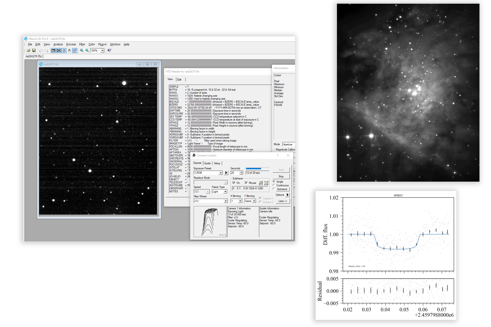

# ASCOM camera driver for the 1280SciCam
Basic ASCOM camera driver for the near-infrared (SWIR) 1280SciCam InGaAs camera (Princeton Infrared Technologies (PIRT)) using the BitFlow Axion 1xE frame grabber and SDK. 

Made for SPIRIT - SPeculoos InfraRed Imager for Transits. 

Please refer to my [PhD thesis](https://doi.org/10.17863/CAM.96904) and the SPIE proceedings where I used this camera for further details, specifically see Sect. 6.1.3 in my thesis for a description of how camera driver was designed our its function and use with 32 bit [MaxIm DL](https://diffractionlimited.com/product/maxim-dl/) and [ACP](http://acp.dc3.com/index2.html).

By default, the 1280SciCam produced 1280×1024 14 bit images (in 16 bit files with this driver) at a frequency of 1/(frame time). The frame time was user-settable and defined as the time from the start of an exposure to frame read.

While the camera could be programmed to trigger single exposures on an external signal, this approach was found to increase read noise. This driver thus employed a continuous mode (where frames were produced immediately one after another) with a dynamic frame time set by the driver per exposure time, where the frame time was set to be the exposure time plus a 100 ms buffer. We did not optimise the buffer time duration, as it was negligible compared to our typical exposure times. However, we did observe that shorter buffer times occasionally introduced image banding artefacts, further investigation is needed to fully understand this and its effect on photometric quality.

See below for a screenshot of the camera in action with MaxIm DL on 1m class telescope at SPECULOOS-South, Paranal Observatory, Chile. Also shown, image of the Trapezium in Orion taken with the camera in the zYJ filter, and a transit of TRAPPIST-1b (also in the zYJ filter).




## Resources/tips for developers

You will need Windows and Visual Studio (with .NET and C++ dependencies) to develop the ASCOM driver

- [ASCOM Platform (make sure to install developer dependencies)](https://github.com/ASCOMInitiative/ASCOMPlatform/releases)
- [Introduction to Developing ASCOM Drivers](<./Introduction to Developing ASCOM Drivers.pdf>)
- [ASCOM Camera properties](https://ascom-standards.org/Help/Developer/html/Properties_T_ASCOM_DeviceInterface_ICameraV3.htm)
- [BitFlow .NET 6.40 SDK (you may need to "unblock" downloaded zip via file properties for things to work for development)](www.bitflow.com/downloads/BitFlow.NET_SDK640.zip)
- [BitFlow .NET Documentation](https://www.bitflow.com/BF.NET/html/index.html)
- [Help with 32/64 bit driver install](https://ascomtalk.groups.io/g/Developer/topic/88285738#msg4745)

The majority code of interest is in [Driver.cs](ASCOM.PIRT1280SciCam2.Camera/Driver.cs). 

_Please note, if you're not using ACP, you may want to get rid of the portion of code that deals with the slowness of ACP (if not included, ACP would hang):_

```c#
// REMOVE FIRST IF NOT USING ACP
if (cameraImageReady && (DateTime.Now - exposureRequestedStart).TotalSeconds < 1.5)
...
```
            

## Installation

At the moment, the driver was operated via the compiled version from Visual Studio. When I next have a camera in the lab, I would like to make an installer for the driver.


## Python example code for testing the camera

Directly via ASCOM driver (access to all ASCOM commands)
```python
from astropy.io import fits
import time
import win32com.client
import matplotlib.pyplot as plt

driver = "ASCOM.PIRT1280SciCam2.Camera"

# Connect to camera
camera = win32com.client.Dispatch(driver)
camera.connected = True

# Set exposure time and start exposure
exptime = 1
camera.StartExposure(exptime, True) # boolean bit for shutter, if it existed.

# Wait for image to be ready
while not camera.ImageReady:
    time.sleep(0.1)

# Get image
image = camera.ImageArray

# Save image (optional, add header information if needed)
hdu = fits.PrimaryHDU(image)
hdu.writeto('test.fits')

# Display image
plt.imshow(hdu.data, cmap='gray')
plt.colorbar()
plt.show()

```

Via Maxim DL (comes with headers from MaxIm DL, e.g. detector temperature, time of acquisition, etc.)
```python
import win32com.client
import time

# Connect to camera
camera = win32com.client.Dispatch("MaxIm.CCDCamera")
camera.LinkEnabled = True

# Set exposure time and start exposure
exptime = 1
camera.Expose(exptime, 1, 0) # exposure time, exposure time, filter (if filter wheel set to 0 position)

# Wait for image to be ready
while not ccd.ImageReady:
    time.sleep(0.1)

# Save image
camera.SaveImage('test.fits')
```